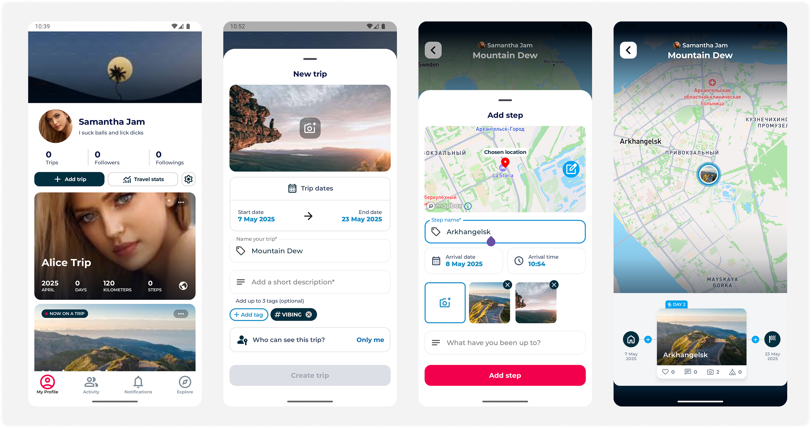

<h1 align="center">Travelogue</h1>

<p align="center">
<a href="https://github.com/Mareanexx"></a>
<a href="https://developer.android.com/jetpack/androidx/releases/compose?hl=ru"></a>
<a href="https://www.figma.com/design/klfiihq6uZGvwliwDTgps9/TravelogueMobileApp?node-id=550-342&t=6GUmUzh3MxNbUBiW-0"></a>
</p>
<div align="center" width="100%">
   
</div>

**Travelogue** — это Android-приложение для ведения журнала путешествий с возможностью прикрепления точек на карте, фотографий и описаний. Приложение позволяет делиться своими поездками с другими пользователями, просматривать чужие путешествия, лайкать, комментировать и подписываться на профили.

---

## Содержание
1. [Назначение](#назначение)
2. [Основной функционал](#основной-функционал)
3. [Описание проекта](#описание-проекта)
4. [Стек технологий](#стек-технологий)
5. [Скриншоты](#скриншоты)
6. [Установка и сборка](#установка-и-сборка)
7. [Скачать APK](#скачать-apk)

---

## Назначение

Приложение предназначено для пользователей, которые хотят сохранять воспоминания о своих путешествиях, отмечая интересные места на карте и сопровождая их фотографиями и описаниями.  
Travelogue также предлагает функции социальной сети, позволяя следить за другими пользователями, оценивать и обсуждать их поездки.

---

## Основной функционал

- Регистрация и аутентификация пользователей
- Создание и редактирование путешествий
- Добавление точек на карту с координатами, фото и описанием
- Просмотр чужих путешествий, подписка на авторов
- Комментирование меток и оставление реакций в виде лайков
- Профиль пользователя с отображением его активности
- Хранение данных в локальной базе при отсутствии интернета

---

## Описание проекта

Архитектура проекта построена на принципах **Clean Architecture**, обеспечивающей строгую разделенность логики по слоям:

- **Domain Layer** — бизнес-логика, use-case'ы
- **Data Layer** — работа с Room, Retrofit, DTO и маппинг
- **Presentation Layer** — UI на Jetpack Compose, `ViewModel` и управление состоянием через `State`

Все зависимости внедряются с помощью DI-библиотеки **Hilt**.

### Хранение данных

Для хранения данных используется **Room** - локальная база данных. Каждая сущность имеет свой DAO-интерфейс.
Приложение продолжает работать без интернета с последующей синхронизацией данных при восстановлении соединения.

### Сетевые запросы

Сетевое взаимодействие реализовано с использованием **Retrofit** и **GSON**.  
Для асинхронной обработки используется **Kotlin Flow** и **Coroutines**.

### Многопоточность

Бизнес-логика (работа с БД и сетью) выполняется в корутинах. 
Продумана отмена фоновых задач при покидании экрана, а также реализована централизованная обработка ошибок.

---

## Стек технологий

- **Язык**: Kotlin
- **Архитектура**: Clean Architecture (MVVM + UseCases)
- **UI**: Jetpack Compose
- **DI**: Hilt
- **База данных**: Room
- **Асинхронность**: Kotlin Coroutines + Flow
- **Сетевые запросы**: Retrofit + GSON
- **Локальное хранилище**: DataStore
- **Навигация**: Jetpack Navigation
- **Карты**: Mapbox SDK

---

## Скриншоты



---

## Установка и сборка

1. Клонируйте репозиторий:

    ```bash
    git clone https://github.com/Mareanexx/travelogue-app.git
    ```

2. Откройте проект в **Android Studio**  
   (рекомендуемая версия — *Android Studio 2024.2.1* или выше)

3. Убедитесь, что установлены:
    - Gradle: **8.9**
    - Android Gradle Plugin: **8.7.0**

4. Синхронизируйте проект с Gradle и выполните сборку.

5. Запустите приложение на устройстве или эмуляторе с **Android 8.0 (API 26)** или выше.

---

## Скачать APK

Готовые сборки доступны в разделе **[Releases](https://github.com/Mareanexx/travelogue-app/releases)**.  
Вы можете скачать `.apk` файл и установить приложение вручную.

---
